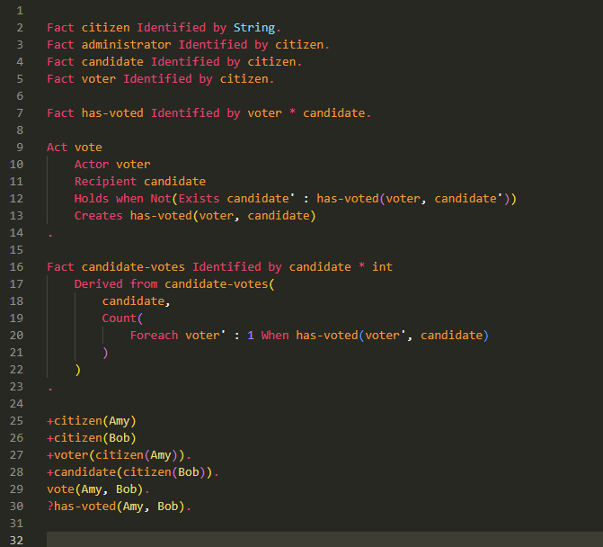
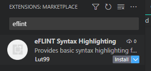
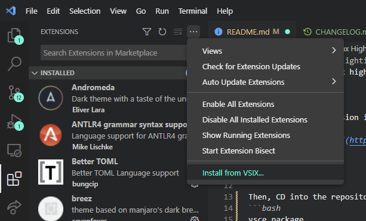
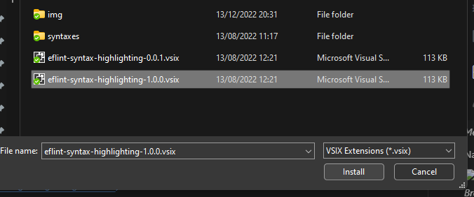
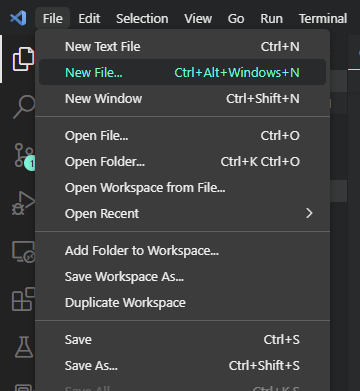
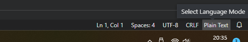
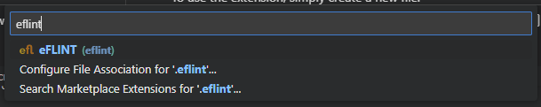

# eFLINT Syntax Highlighting
Provides basic syntax highlighting for the [eFLINT language](https://gitlab.com/eflint) for Visual Studio Code.


## Features
Adds basic syntax highlighting for most keywords, buildin functions and data types for eFLINT. For example:


  
_Example of the eFLINT syntax highlighter using the builtin Monokai theme._

More constructs or features may be added in the future. Ideally, a language server might even provide much more advanced syntax highlighting.


## Installation
To install the extension in your local setup, you can either download the extension via the marketplace (recommended), download the package VSIX file from the repository or compile the VSIX file yourself.

### Marketplace
To download the extension from the marketplace, simply go the `Extensions` tab in Visual Studio Code.

Then, search for "eflint" and click on `Install` to install the latest version.

  
_Menu to install the extension from the marketplace._

This method is recommended because you can also automatically receive updates.


### Downloading
You can also choose to download a specific version of the extension from its [repository](https://gitlab.com/eflint/tools/syntax-highlighting-vscode/-/releases). Simply select the desired release, and then download the `.vsix` file to someplace on your machine (where does not matter, as long as you can find it).

Then, you can install the extension by going to the `Extensions` tab in Visual Studio Code and then clicing the three-dot menu at the top of the middle panel. From there, you can select `Install from VSIX...`.

  
_Menu to install a local .vsix file._

Navigate to the `.vsix` file you downloaded, and click `Install`.

  
_Browsing to a .vsix file on Windows._

The extension should be installed once this operation completes.


### Compilation
Before you begin, you should first install [`npm`](https://docs.npmjs.com/downloading-and-installing-node-js-and-npm) on your machine. Once done, you can install the [`vsce`](https://github.com/microsoft/vscode-vsce) package we will use to build the extension:
```bash
npm install -g vsce
```

Then you can clone the [repository](https://gitlab.com/eflint/tools/syntax-highlighting-vscode):
```bash
git clone https://gitlab.com/eflint/tools/syntax-hightlighting-vscode
cd ./syntax-highlighting-vscode
```

With `vsce` installed and the repository cloned, you can compile the extension by running:
```bash
vsce package
```

This will generate the package `.vsix` file for us.

To install the extension, you can follow the steps taken for [downloading](#downloading) the extension, except that you already have a `.vsix` file ready (so no need to download it from the repository).


## Usage
To use the extension, simply create a new file.

  
_Steps to create a new file._

If you give the new file a `.eflint` extension, the extension should be enabled on this file automatically. If not, you can manually select it in the lower-right corner of the window.

  
_The button to open the language selection menu._

  
_The menu to select the eFLINT language for this file._

## Release Notes
A brief overview of each release is given here. For more details, check the [CHANGELOG.md](https://gitlab.com/eflint/tools/syntax-highlighting-vscode/-/blob/main/CHANGELOG.md) file.

### 1.1.1
Bug fixes for comments and links in the README.

### 1.1.0
Added support for a lot more keywords, operators and identifiers. Also added an icon for the language.

### 1.0.0
Initial release of the extension.
